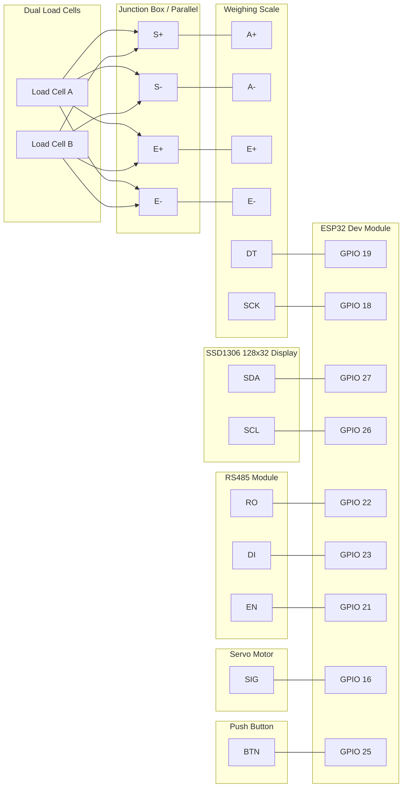

# ESP32 智能称重系统手册 (Smart Weighing System Manual)

## 1. 项目概述 (Overview)
本项目是一个基于 ESP32 的智能称重控制单元，集成了高精度称重传感器(HX711)、OLED 显示屏、舵机控制以及 RS485 通信接口，专为自动化称重与分拣场景设计。

### 1.1 核心功能
*   **精准称重**: 实时计算重量，支持去皮和线性标定。
*   **本地显示**: OLED 屏实时显示重量和系统状态。
*   **双模式标定**: 支持通过 RS485 远程标定，也支持通过 **物理按钮** 进行完全本地化的标定。
*   **执行控制**: 驱动舵机进行开关动作 (Open/Close)。
*   **数据持久化**: 标定参数 (系数/零点) 自动保存至 Flash (NVS)，断电不丢失。

---

## 2. 硬件指南 (Hardware Guide)

### 2.1 接线图 (Wiring Diagram)
接线设计已简化，移除了 VCC/GND 标注以提高清晰度。

### 2.2 称重传感器接线 (Load Cell Wiring)
由于使用了双传感器 (Dual Load Cell)，存在零点不一致的风险。建议使用**接线盒 (Junction Box)** 进行调平。

**方案 A: 接线盒 (推荐)**
*   传感器 A & B -> 接线盒 (内部调平) -> HX711

**方案 B: 直接并联 (简化版)**
如果无法使用接线盒，可采用直接并联，但需注意抗偏载能力较弱。
*   **E+ (红)**: 传感器 A 红 + 传感器 B 红 -> HX711 E+
*   **E- (黑)**: 传感器 A 黑 + 传感器 B 黑 -> HX711 E-
*   **S+ (绿)**: 传感器 A 绿 + 传感器 B 绿 -> HX711 A+
*   **S- (白)**: 传感器 A 白 + 传感器 B 白 -> HX711 A-

> [!WARNING]
> 直接并联时，若两个传感器灵敏度差异较大，物体放置位置不同会导致重量读数波动 (偏载误差)。

### 2.3 引脚定义
*   **HX711**: DT (IO19), SCK (IO18)
*   **OLED**: SDA (IO27), SCL (IO26), Resolution: 128x32
*   **RS485**: RX (IO22), TX (IO23), EN (IO21)
*   **Servo**: SIG (IO16)
*   **Button**: SIG (IO25)

---

## 3. 操作说明与通信协议

关于设备按键的具体操作（去皮、配置站号）、界面的具体含义，以及与主站通信的 RS485 Modbus RTU 寄存器控制指令清单（远程下发去皮、标定、开关门等），请统一参考独立的用户操作手册：
👉 [User_Manual.md](./User_Manual.md)

---

## 5. 架构说明
*   **分布式计算**: 重量计算在 ESP32 本地完成 (Raw -> Weight)，减轻上位机负担，保证 OLED 显示无延迟。
*   **手动标定逻辑**:
    *   `Factor = (Raw_ADC - Zero_Offset) / Known_Weight`
    *   系统仅保存 `Factor` 和 `Zero_Offset` 到 NVS。
