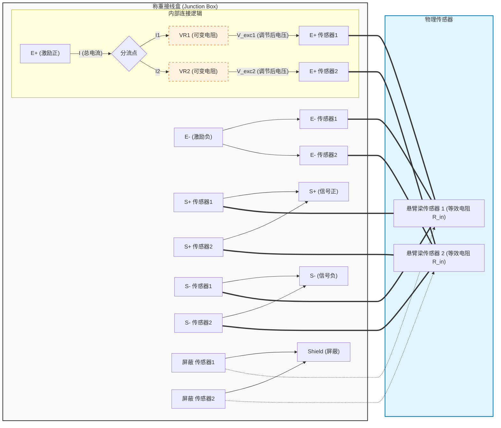

# 称重传感器原理图

此原理图展示了两个悬臂梁传感器（Cantilever Beam Load Cells）通过含有角差调节电位器的接线盒（Junction Box）进行并联的连接方式。

## 原理说明

接线盒中的电位器（VR1, VR2）通常作为 **可变电阻串联在激励回路（E+）中**。

它们与传感器本身的输入电阻（通常为 350Ω 或 700Ω）构成一个分压电路。通过调节电位器的阻值（通常很小，如 10Ω - 50Ω），我们可以微调施加在每个传感器上的实际激励电压，从而改变该传感器的输出灵敏度，达到“调角”平衡的目的。

## 关键点解释

1.  **串联分压 (Series Voltage Divider)**:
    *   电位器 **不是** 作为一个独立的电压源（像三端稳压器那样）。
    *   它实际上是一个 **可变电阻**，串联在电源和传感器之间。
    *   **原理**: $V_{sensor} = V_{source} \times \frac{R_{sensor}}{R_{sensor} + R_{pot}}$。
    *   因为 $R_{sensor}$ (传感器输入阻抗) 远大于 $R_{pot}$ (电位器阻值)，所以调节电位器可以微小地降低传感器的供电电压。

2.  **接线**:
    *   **E+ (Excit +)**: 接线盒输入，分两路经过两个电位器。
    *   **E- / S+ / S-**: 这些线通常是直接并联的，不经过电阻（除非有特殊的温度补偿电路，但那是另外的话题）。

## 工程上的忽略与权衡

在实际工程应用中，这种标准的无源接线盒确实**不处理**以下两个问题，而是选择**忽略**它们：

1.  **零点不一致 (Zero Balance)**:
    *   **现象**: 两个传感器的空载输出不完全一样（例如一个+0.1mV，一个-0.1mV）。
    *   **处理**: 直接并联后，信号会自动叠加平均。
    *   **工程理由**: 
        *   零点仅仅是一个**固定偏差 (Offset)**。
        *   这个偏差可以通过仪表或控制器的 **去皮 (Tare)** 或 **系统零点标定 (System Zero Calibration)** 轻松消除。
        *   只要这个偏差是**稳定**的（不随时间剧烈漂移），它就不影响测量的**准确度**（即增量变化的准确性）。

2.  **非线性不一致 (Non-linearity)**:
    *   **现象**: 两个传感器在不同负载下的输出曲线略有不同（非完全直线的弯曲程度不同）。
    *   **处理**: 接线盒不做任何处理。
    *   **工程理由**:
        *   **微小量**: 对于正规厂家生产的同型号传感器，其非线性误差通常非常小（例如 0.02% F.S.），它们之间的非线性差异更是微乎其微。
        *   **成本效益**: 要通过电路修正传感器的非线性通常需要非常复杂的有源电路或数字算法，这在简单的模拟接线盒中是不划算的。
        *   **系统精度**: 对于绝大多数工业应用（如料斗秤、平台秤），这种微小的非线性误差完全在系统允许的总误差范围内。

**结论**: 工程上直接并联信号正 (S+) 和信号负 (S-) 不仅是可行的，而且是**行业标准做法**。它通过牺牲极微小的精度（非线性差异）和依赖后端处理（去皮消零），换取了极大的系统**简单性**、**可靠性**和**低成本**。

## 角差调整步骤 (Corner Adjustment)

为了确保重物放在秤台的任一侧时，读数都一致，需要进行“调角”操作。具体步骤如下：

1.  **准备工作**:
    *   将接线盒的所有电位器（VR1, VR2）调至阻值最小位置（通常是顺时针或者逆时针到底，使传感器获得最大激励电压）。
    *   确保证书上的 **输出灵敏度 (mV/V)** 参数一致，如果不一致，可以通过调节电位器来补偿。

2.  **偏载测试**:
    *   准备一个 **标准砝码**（建议为最大量程的 1/3 到 1/2）。
    *   将砝码分别放置在 **传感器 1** 的正上方和 **传感器 2** 的正上方。
    *   记录两个位置的仪表读数。
        *   读数 A (传感器 1 上方)
        *   读数 B (传感器 2 上方)

3.  **计算与调节**:
    *   比较读数 A 和 B。
    *   **原则**: 调节显示数值 **偏大** 那个传感器对应的电位器。
    *   **操作**: 调大该电位器的阻值（通常是旋转电位器），降低该传感器的激励电压，从而降低其输出信号。
    *   **目标**: 调节直到 读数 A = 读数 B。

4.  **举例**:
    *   如果砝码在传感器 1 上显示 10.05kg，在传感器 2 上显示 10.00kg。
    *   说明传感器 1 的输出偏大。
    *   调节 **VR1**，增加 VR1 的阻值，使传感器 1 的显示值降低，直到它也显示 10.00kg（或者两者都变为 10.02kg 等中间值）。
    *   重复测试，直到两个位置的误差在允许范围内。

5.  **最终标定**:
    *   调角完成后，需要对整个秤进行一次标准的 **量程标定 (Span Calibration)**，以确保存重量值的准确性。
