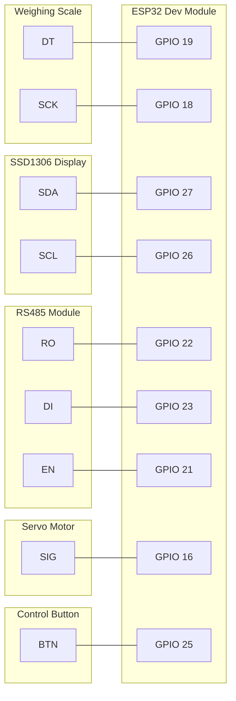

# 硬件接线图 (Hardware Wiring Diagram)

## 接线表

| 组件 (Component) | 引脚 (Pin) | ESP32 引脚 | 备注 (Note) |
| :--- | :--- | :--- | :--- |
| **HX711** | DT | GPIO 19 | 数据引脚 |
| | SCK | GPIO 18 | 时钟引脚 |
| | VCC | 3.3V / 5V | 建议 5V 供电以提高稳定性 |
| | GND | GND | |
| **SSD1306 OLED** | SDA | GPIO 27 | I2C 数据 |
| | SCL | GPIO 26 | I2C 时钟 |
| | VCC | 3.3V | |
| | GND | GND | |
| **RS485 Module** | DI (TX) | GPIO 23 | Serial2 TX |
| | RO (RX) | GPIO 22 | Serial2 RX |
| | DE/RE | GPIO 21 | 发送/接收使能 (TX Enable) |
| | VCC | 3.3V / 5V | 取决于模块电压 |
| | GND | GND | |
| **Servo** | SIG (Signal) | GPIO 16 | PWM 信号 |
| | VCC | 5V | 舵机通常需要 5V |
| | GND | GND | |
| **Button** | | GPIO 25 | 控制按键 |

*> [!NOTE]
> 对于普通的 MAX485 模块，通常需要一个引脚控制 DE/RE。如果使用带有自动流控的 RS485 模块，则无需额外引脚。当前代码仅定义了 RX/TX，假设使用自动流控模块或已硬件处理收发切换。*

## 原理图 (Mermaid)

